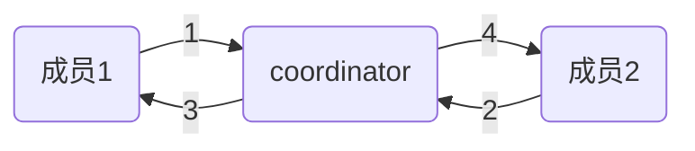

## kafka消费组(consumer group)

### 一、消费组

#### 1. 什么是消费组

consumer group是kafka提供的可扩展且具有容错性的消费者机制。既然是一个组，那么组内必然可以有多个消费者或消费者实例(consumer instance)，它们共享一个公共的ID，即group ID。组内的所有消费者协调在一起来消费订阅主题(subscribed topics)的所有分区(partition)。当然，每个分区只能由同一个消费组内的一个consumer来消费。理解consumer group记住下面这三个特性：

- consumer group下可以有一个或多个consumer instance，consumer instance可以是一个进程，也可以是一个线程
- group.id是一个字符串，唯一标识一个consumer group
- consumer group下订阅的topic下的每个分区只能分配给某个group下的一个consumer

#### 2. 消费者位置(consumer position)

消费者在消费的过程中需要记录自己消费了多少数据，即消费位置信息。在Kafka中这个位置信息有个专门的术语：位移(offset)。很多消息引擎都把这部分信息保存在服务器端(broker端)。这样做的好处当然是实现简单，但会有三个主要的问题：1. broker从此变成有状态的，会影响伸缩性；2. 需要引入应答机制(acknowledgement)来确认消费成功。3. 由于要保存很多consumer的offset信息，必然引入复杂的数据结构，造成资源浪费。而Kafka选择了不同的方式：每个consumer group保存自己的位移信息，那么只需要简单的一个整数表示位置就够了；同时可以引入checkpoint机制定期持久化，简化了应答机制的实现

#### 3. 位移管理(offset management)

##### 3.1 手动vs自动

Kafka默认是定期帮你自动提交位移的(enable.auto.commit = true)，当然可以选择手动提交位移实现自己控制。另外kafka会定期把group消费情况保存起来，做成一个offset map。

##### 3.2 位移提交

老版本的位移是提交到zookeeper中的，目录结构是:/consumers/<group.id>/offsets/\<topic\>/\<partitionId\>，但是zookeeper其实并不适合进行大批量的读写操作，尤其是写操作。因此kafka提供了另一种解决方案：增加\_\_consumeroffsets topic，将offset信息写入这个topic，摆脱对zookeeper的依赖(指保存offset这件事情)。__consumer_offsets中的消息保存了每个consumer group某一时刻提交的offset信息。依然以上图中的consumer group为例，格式大概如下：

__consumers_offsets topic配置了compact策略，使得它总是能够保存最新的位移信息，既控制了该topic总体的日志容量，也能实现保存最新offset的目的。compact的具体原理请参见：[Log Compaction](https://kafka.apache.org/documentation/#compaction)

#### 4. Rebalance

##### 4.1 什么是Rebalance

rebalance本质上是一种协议，规定了一个consumer group下的所有consumer如何达成一致来分配订阅topic的每个分区。比如某个group下有20个consumer，它订阅了一个具有100个分区的topic。正常情况下，Kafka平均会为每个consumer分配5个分区。这个分配的过程就叫rebalance。

##### 4.2 什么时候rebalance

这也是经常被提及的一个问题。rebalance的触发条件有三种：

- 组成员发生变更(新consumer加入组、已有consumer主动离开组或已有consumer崩溃了）
- 订阅主题数发生变更——这当然是可能的，如果你使用了正则表达式的方式进行订阅，那么新建匹配正则表达式的topic就会触发rebalance
- 订阅主题的分区数发生变更

##### 4.3 如何进行组内分区分配

之前提到了group下的所有consumer都会协调在一起共同参与分配，这是如何完成的？Kafka新版本consumer默认提供了两种分配策略：range和round-robin。当然Kafka采用了可插拔式的分配策略，你可以创建自己的分配器以实现不同的分配策略。实际上，由于目前range和round-robin两种分配器都有一些弊端，Kafka社区已经提出第三种分配器来实现更加公平的分配策略，只是目前还在开发中。我们这里只需要知道consumer group默认已经帮我们把订阅topic的分区分配工作做好了就行了。

简单举个例子，假设目前某个consumer group下有两个consumer： A和B，当第三个成员加入时，kafka会触发rebalance并根据默认的分配策略重新为A、B和C分配分区，如下图所示：

##### 4.4 谁来执行rebalancce和consumer group管理

Kafka提供了一个角色：coordinator来执行对于consumer group的管理。kafka对于coordinator的设计与修改是一个很长的故事。最新版本的coordinator也与最初的设计有了很大的不同。

首先是0.8版本的coordinator，那时候的coordinator是依赖zookeeper来实现对于consumer group的管理的。Coordinator监听zookeeper的/consumers/\<group>/ids的子节点变化以及/brokers/topics/\<topic>数据变化来判断是否需要进行rebalance。group下的每个consumer都自己决定要消费哪些分区，并把自己的决定抢先在zookeeper中的/consumers/\<group>/owners/\<topic>/\<partition>下注册。很明显，这种方案要依赖于zookeeper的帮助，而且每个consumer是单独做决定的，没有那种“大家属于一个组，要协商做事情”的精神。

基于这些潜在的弊端，0.9版本的kafka改进了coordinator的设计，提出了group coordinator——每个consumer group都会被分配一个这样的coordinator用于组管理和位移管理。这个group coordinator比原来承担了更多的责任，比如组成员管理、位移提交保护机制等。当新版本consumer group的第一个consumer启动的时候，它会去和kafka server确定谁是它们组的coordinator。之后该group内的所有成员都会和该coordinator进行协调通信。显而易见，这种coordinator设计不再需要zookeeper了，性能上可以得到很大的提升。后面的所有部分我们都将讨论最新版本的coordinator设计。

##### 4.5 如何确定coordinator

- 确定consumer group位移信息写入__consumer_offsets的那个分区，具体的计算公式：

  __consumer_offsets partition = Math.abs(groupId.hashCode()%groupMetadataTopicPartitionCount)，注意：groupMetadataTopicPartitionCount由offsets.topic.num.partitions指定，默认是50个分区。

- 该分区leader所在的broker就是被选定的coordinator

##### 4.6 rebalance Generatoin 

JVM GC的分代收集就是这个词(严格来说是generational)，我这里把它翻译成“届”好了，它表示了rebalance之后的一届成员，主要是用于保护consumer group，隔离无效offset提交的。比如上一届的consumer成员是无法提交位移到新一届的consumer group中。我们有时候可以看到ILLEGAL_GENERATION的错误，就是kafka在抱怨这件事情。每次group进行rebalance之后，generation号都会加1，表示group进入到了一个新的版本，如下图所示： Generation 1时group有3个成员，随后成员2退出组，coordinator触发rebalance，consumer group进入Generation 2，之后成员4加入，再次触发rebalance，group进入Generation 3.

##### 4.7 协议(protocol)

前面说过了， rebalance本质上是一组协议。group与coordinator共同使用它来完成group的rebalance。目前kafka提供了5个协议来处理与consumer group coordination相关的问题：

- Heartbeat请求：consumer需要定期给coordinator发送心跳来表明自己还活着
- LeaveGroup请求：主动告诉coordinator我要离开consumer group
- SyncGroup请求：group leader把分配方案告诉组内所有成员
- JoinGroup请求：成员请求加入组
- DescribeGroup请求：显示组的所有信息，包括成员信息，协议名称，分配方案，订阅信息等。通常该请求是给管理员使用

##### 4.8 liveness

consumer如何向coordinator证明自己还活着？ 通过定时向coordinator发送Heartbeat请求。如果超过了设定的超时时间，那么coordinator就认为这个consumer已经挂了。一旦coordinator认为某个consumer挂了，那么它就会开启新一轮rebalance，并且在当前其他consumer的心跳response中添加“REBALANCE_IN_PROGRESS”，告诉其他consumer：不好意思各位，你们重新申请加入组吧！

##### 4.9 rebalance过程

终于说到consumer group执行rebalance的具体流程了，rebalance的前提是coordinator已经确定了。总体而言，rebalance分为2步：Join和Sync

1 Join， 顾名思义就是加入组。这一步中，所有成员都向coordinator发送JoinGroup请求，请求入组。一旦所有成员都发送了JoinGroup请求，coordinator会从中选择一个consumer担任leader的角色，并把组成员信息以及订阅信息发给leader——注意leader和coordinator不是一个概念。leader负责消费分配方案的制定。

2 Sync，这一步leader开始分配消费方案，即哪个consumer负责消费哪些topic的哪些partition。一旦完成分配，leader会将这个方案封装进SyncGroup请求中发给coordinator，非leader也会发SyncGroup请求，只是内容为空。coordinator接收到分配方案之后会把方案塞进SyncGroup的response中发给各个consumer。这样组内的所有成员就都知道自己应该消费哪些分区了。

加入组的流程：

其中：

1：joinGroup请求{我是成员1，我要订阅topicA}

2：joinGroup请求{我是成员2，我要订阅topicB}

3：joinGroup响应{你是这个组的Leader，generation是2，订阅情况:成员1->[topicA]，成员2->[topicB]}

4：joinGroup响应{批准加入，你们组的Leader是成员1}

值得注意的是， 在coordinator收集到所有成员请求前，它会把已收到请求放入一个叫purgatory(炼狱)的地方，然后是分发分配方案的过程，即SyncGroup请求：

其中：

1：syncGroup请求：{我是成员1，也是Leader，当前generation是2，分配方案：成员1消费topicA的分区0，成员2消费topicB的分区0}

2：syncGroup请求：{我是成员2，所在Group的generation是2}】

3：syncGroup响应：{成员1，Leader做的分配方案，你消费topicA的分区0数据}

4：syncGroup响应：{成员2，Leader做的分配方案，你消费topicB的分区1数据}

consumer group的分区分配方案是在客户端执行的！Kafka将这个权利下放给客户端主要是因为这样做可以有更好的灵活性。比如这种机制下我可以实现类似于Hadoop那样的机架感知(rack-aware)分配方案，即为consumer挑选同一个机架下的分区数据，减少网络传输的开销。Kafka默认为你提供了两种分配策略：range和round-robin。由于这不是本文的重点，这里就不再详细展开了，你只需要记住你可以覆盖consumer的参数：partition.assignment.strategy来实现自己分配策略就好了。

##### 4.10 consumer group 状态机

和很多kafka组件一样，group也做了个状态机来表明组状态的流转。coordinator根据这个状态机会对consumer group做不同的处理，如下图所示

简单说明下图中的各个状态：

- Dead：组内已经没有任何成员的最终状态，组的元数据也已经被coordinator移除了。这种状态响应各种请求都是一个response： UNKNOWN_MEMBER_ID
- Empty：组内无成员，但是位移信息还没有过期。这种状态只能响应JoinGroup请求
- PreparingRebalance：组准备开启新的rebalance，等待成员加入
- AwaitingSync：正在等待leader consumer将分配方案传给各个成员
- Stable：rebalance完成！可以开始消费了~

 ### 三、rebalance场景剖析

上面详细阐述了consumer group是如何执行rebalance的，可能依然有些云里雾里。这部分对其中的三个重要的场景做详尽的时序展开，进一步加深对于consumer group内部原理的理解。由于图比较直观，所有的描述都将以图的方式给出。

##### 1. 新成员加入

##### 2. 组成员崩溃

##### 3. 组成员主动离组

##### 4. 提交移位

